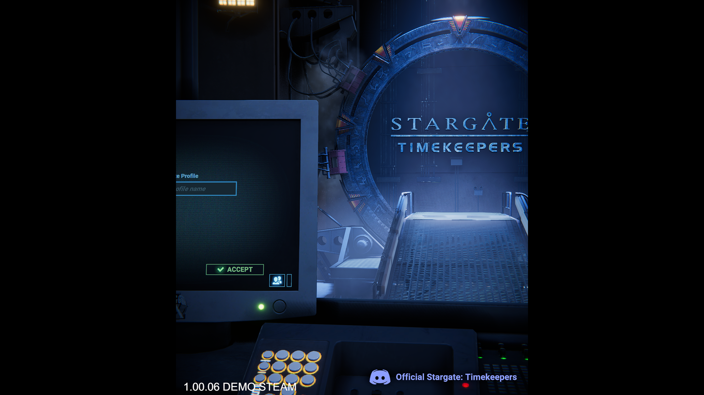
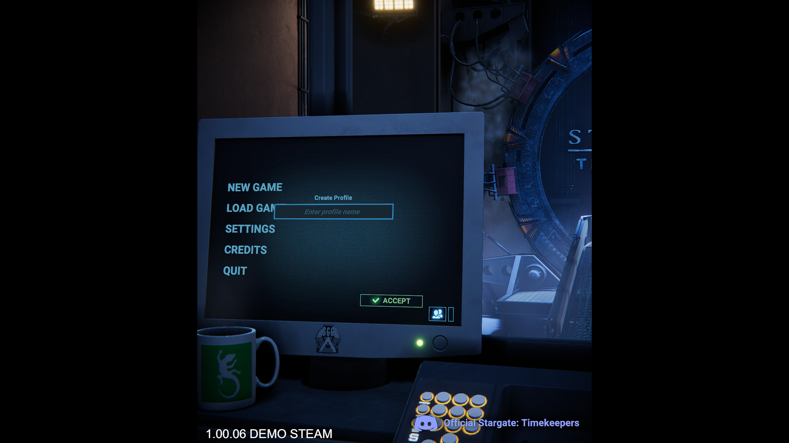
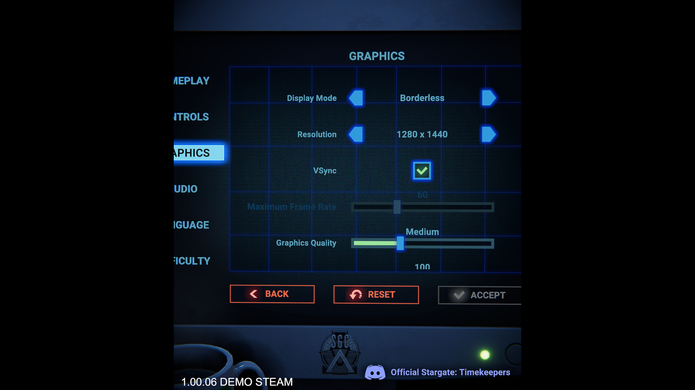

# stargate: timekeepers menu fix

Workaround for the Stargate: Timekeepers demo displaying only a 3rd of the screen, with the settings menu button being off screen.

Slightly rotates the camera on the main menu, allowing you to access the Settings menu to fix the problem.

1. Install Bepinex + the mod
2. Launch the game
3. Create a profile, if needed
4. Change your resolution in the settings menu
5. Uninstall this mod

###

## Requirements

* BepinEx >= 5.4.21

## Installation

* Install BepinEx in the game folder normally
* Download StargateMenuFix.dll and add to your `PlateUp/BenInEx/plugins` folder.
